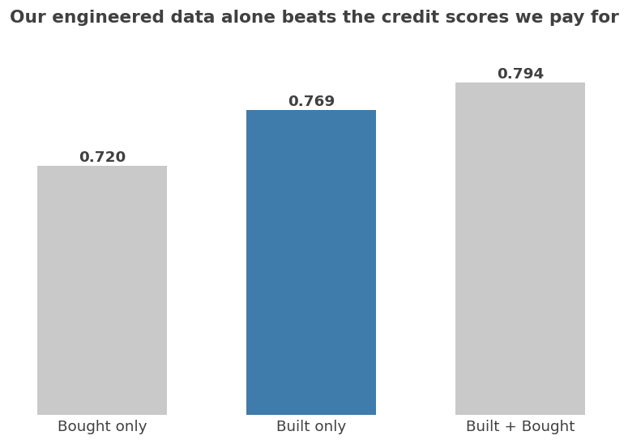
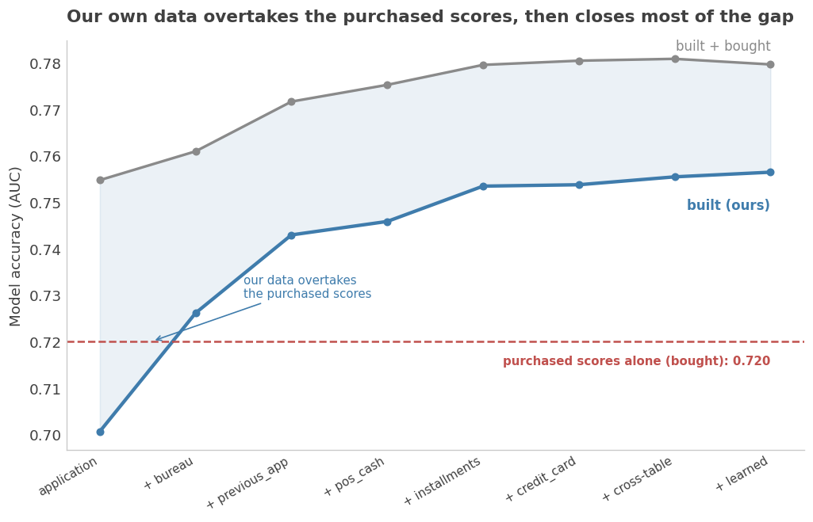
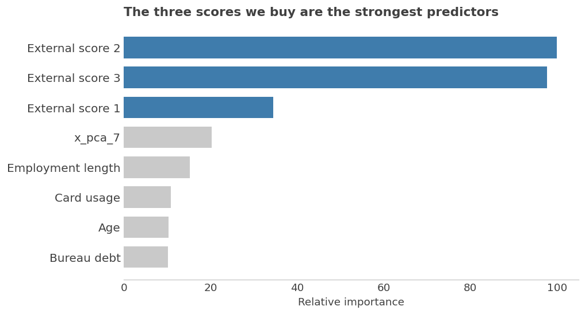

# Bought or Built?
### How much of a credit-risk model's power is purchased, and how much is engineered from the lender's own data
*MSDS 696 · Practicum II · Home Credit Default Risk*

Open a strong credit-risk model and an uncomfortable share of its predictive power comes from a few external scores the lender buys: third-party risk ratings priced per applicant. This project measures exactly how much, and asks whether the lender's own data could do the same job for free.

## The question

The Home Credit dataset ships three `EXT_SOURCE` columns, documented as normalized scores from an external data source, the kind of third-party rating a lender pays to obtain. Everything else is data the lender already owns. The project answers three questions, each as a measured difference in out-of-fold AUC with the model held fixed and only the data changed:

- How much of a default model's power comes from the purchased scores versus features engineered in-house?
- How much of that gap can feature engineering close without paying?
- Where do the purchased scores stay irreplaceable?

## Headline results

| Data the model sees | OOF AUC |
| --- | --- |
| Purchased scores only (bought) | 0.720 |
| Engineered internal features only (built) | 0.769 |
| Both combined | 0.794 |

- **Built beats bought.** Features engineered from the lender's own data out-predict the three purchased scores on their own, 0.769 against 0.720.
- **The scores still add unique signal.** Combining both lifts AUC to 0.794, and only 20 to 50% of each score can be reconstructed from internal data. The rest is information the lender cannot rebuild.
- **The value is concentrated, not uniform.** The purchased scores help most for thin-file, higher-risk applicants and least for well-documented ones, which turns "should we buy?" into a per-loan economic question rather than a blanket policy.
- **Kaggle public leaderboard: 0.79890 AUC**, in range of the winning solutions (~0.806).



Adding the lender's own data one table at a time, the built model overtakes the purchased scores early and then closes most of the remaining gap:



## How it works

**Data.** About 307,000 loan applications across seven relational tables: the application itself, credit-bureau records, prior loans, POS and cash balances, installment payments, and credit-card balances. Much of the work is collapsing the one-to-many sprawl into one clean row per applicant.

**Feature engineering.** Roughly 3,500 features across five rounds: per-table aggregations, ratios, recency windows and trends; cross-table signals; and unsupervised representation learning (PCA, KMeans, and a denoising autoencoder), each yielding an embedding or anomaly signal a tree cannot build on its own. Every internal feature is computed without ever touching `EXT_SOURCE`.

**Selection.** Null-importance screening followed by a randomized backward-stability pass trims the candidates to about 440 features that carry stable signal.

**The experiment.** One fixed, untuned LightGBM is trained on deliberately different feature sets. Because only the data changes, every AUC gap is attributable to the data, not to tuning. A single Optuna pass tunes the final model for the leaderboard.

**Interpretation.** Beyond the ablation ladder: the external scores are reverse-engineered (predict `EXT_SOURCE` from internal features) to measure how much is redundant; SHAP and segment analysis show where the signal lives; and a decision-level simulation replays the approve or decline decision with and without the scores, converting the accuracy gain into a per-loan value that can be weighed against the price.

Individually, the three purchased scores dominate the model's feature importance, which is what makes the "built beats bought" result non-obvious:



## Repository

```
notebooks/     run in order
  01           auto-EDA profile of the raw Home Credit tables
  02           baseline: three untuned LightGBM (external / internal / combined) on the raw form
  03-09        feature engineering, one notebook per table (internal only)
  10           external-score features, isolated (EXT_SOURCE-derived)
  11           cross-table features (signals combining tables)
  12-14        unsupervised features: KMeans, PCA, denoising autoencoder
  15           feature selection (null-importance, then backward stability)
  16           value of the data: engineered vs baseline, thin vs thick files, by-source progression
  17           reverse-engineering: reconstruct EXT_SOURCE from internal data
  18           interpretation: SHAP feature effects
  19           segments: subgroup performance (age, income, gender)
  20           signal deep-dive: which feature families carry the signal
  21           optimization: one Optuna tune of the final model
  22           kaggle submission: combined and internal-only predictions
  23           executive visuals
  24           value in dollars: decision-level simulation and the buy rule
src/           reusable code: aggregation, higher moments, selection, master assembly, progression
data/          Home Credit tables and local outputs (gitignored)
eda/           generated auto-EDA reports (gitignored)
```

Every model in the study is the same fixed, untuned LightGBM. The study varies the data, not the model, so the gaps are attributable to features rather than tuning. Hyperparameter tuning is deferred to a single final pass for the Kaggle submission.

## Getting started

```bash
# 1. create and activate the conda environment (Python 3.11 + the data stack)
conda env create -f environment.yml
conda activate credit-signal

# 2. register the Jupyter kernel (so it is selectable in Jupyter / VS Code)
python -m ipykernel install --user --name credit-signal \
  --display-name "Python (credit-signal)"
```

Download the **[Home Credit Default Risk](https://www.kaggle.com/competitions/home-credit-default-risk/data)**
CSVs into `data/raw/` (the data is not committed). Then open a notebook under `notebooks/`
and select the **Python (credit-signal)** kernel. A pip `requirements.txt` is provided as an
alternative to conda.

## References and credits

- **Dataset** — [Home Credit Default Risk](https://www.kaggle.com/competitions/home-credit-default-risk),
  Home Credit Group, via Kaggle.
- **Feature engineering** — a handful of hand-crafted application ratios follow common practice
  shared across public Home Credit solutions (noted inline in notebook 03). The per-table
  aggregation, recency-window, and trend features use standard group-by techniques. All shared
  helpers (`src/aggregate.py`, `src/moments.py`, `src/select.py`) and the entire bought-versus-built
  analysis, reverse-engineering, selection pipeline, and value analysis are original.
